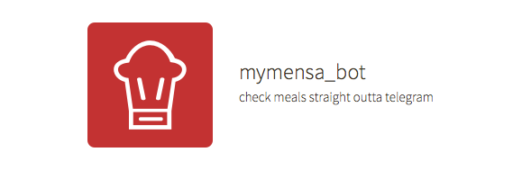

<p align="center">

</p>

# mymensa_bot - <a href="http://telegram.me/mymensa_bot">@mymensa_bot</a>

Simple Telegram Bot for the <a href="https://openmensa.org">OpenMensa API</a> using the <a href="https://github.com/yagop/node-telegram-bot-api">node-telegram-bot-api</a>, written in Node.js.


### Install Dev Environment
```
git clone
npm update
npm start
```

### Commands
#### /mensa [CITY]
**Example:** `/mensa berlin` <br>
**Returns:** custom keyboard with canteen selection
#### /meals [CANTEEN_ID]
**Example:** `/meals 79` <br>
**Returns:** list of meals for the current day

#### /meals [CANTEEN_ID] [EXTRA_ICON]
**Example:** `/meals 79 🌱` <br>
**Returns:** list of meals that match the extra text ('vegetarisch' OR 'vegan') <br><br>
**Example:** `/meals 79 🐮` <br>
**Returns:** list of meals with 'Rindfleisch'<br>


### Extras
| Text  |  Icon |
|---|---|
| 'vegetarisch' OR 'vegan'  | 🌱  |
|  'Alkohol' | 🍷  |
|  'Rindfleisch' |  🐮 |
|  'Schweinefleisch' | 🐷 |
